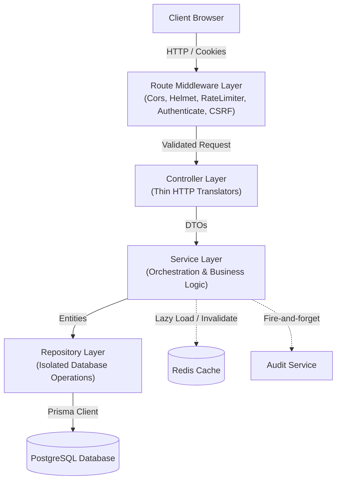
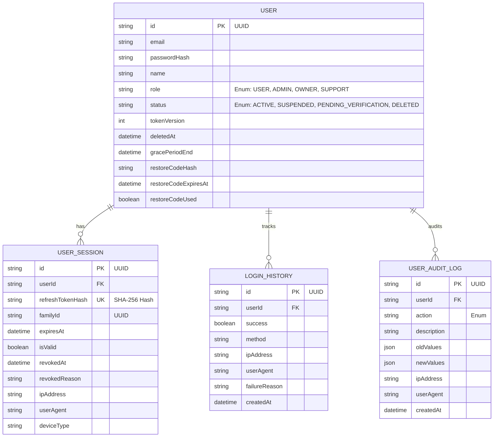

# Engineering Summary Document: `user-service`

This document provides a professional, deep-dive engineering analysis of the `user-service`, an identity, authentication, and user profile management microservice within the **NovaCPU (Remote Compute Platform)** monorepo. It is designed to help engineers, architects, and technical reviewers quickly understand the service's architecture, security controls, technical decisions, and operational characteristics.

---

## 1. Service Overview

### What the Service Does
The `user-service` acts as the core identity provider and authentication authority for the NovaCPU platform. It manages user registrations, handles secure credentials validation, issues stateful/stateless session tokens, provides account recovery flows, manages user profile metadata, and facilitates soft account deletion with a grace period. 

### Main Responsibilities
*   **Authentication & Session Management**: Cookie-based authentication using short-lived Access JWTs and long-lived Refresh JWTs.
*   **Token Rotation & Revocation**: Advanced refresh token rotation, token family tracking, and instant access token invalidation via versioning.
*   **Account Recovery**: Cryptographically secure account restoration using single-use, time-limited verification codes.
*   **Profile Management**: Public profile retrieval and sanitised updates for active users.
*   **Security Auditing**: Asynchronous, fire-and-forget audit logging for all security-sensitive events.

### Core Business Logic
*   **Password Hardening**: Enforces high-entropy hashing for storage and rate-limits brute-force vectors.
*   **Soft Deletion (Grace Period)**: Users can soft-delete accounts, setting a 30-day grace period. During this period, they can log in to trigger a restoration flow or restore using a secure code. Once the 30 days expire, accounts are permanently pruned.
*   **Session Lifecycle Security**: Validates session integrity on every request and triggers global session invalidation on password changes, token reuse detection, or soft deletes.

---

## 2. Architecture & Design

### High-Level Architecture
The service is built on a structured, layered **Clean Architecture** model in TypeScript, enforcing a strict separation of concerns between HTTP transport, business logic, data access, and infrastructure configuration.



### Request Flow
1.  **Ingress**: The request arrives at Express, passing through global security middlewares (`helmet`, `cors`, and `globalLimiter`).
2.  **Route Filtering**: The request hits route-specific middlewares:
    *   **Rate Limiting**: Applied per-route sensitivity (e.g. `authLimiter` for login, `sensitiveLimiter` for recovery).
    *   **Authentication**: Extracts the `accessToken` cookie, verifies signature/expiry, and checks the user's `tokenVersion` (via Redis/PostgreSQL).
    *   **CSRF Protection**: For state-changing methods, compares the `X-CSRF-Token` header with the `csrfToken` cookie.
3.  **Validation**: Zod schema validation parses `req.body`, `req.query`, or `req.params`. If validation fails, it short-circuits with a `400 Bad Request`. On success, it replaces raw request data with sanitized, type-safe data.
4.  **Controller Delegation**: The route handler maps the request metadata (IP, User-Agent) and parsed body into DTOs, then invokes the appropriate service singleton method.
5.  **Business Logic Execution**: The service orchestrates domain operations:
    *   Queries/updates state via repositories.
    *   Checks or invalidates cache entries.
    *   Dispatches asynchronous audit logs.
6.  **Response Mapping**: Output database entities are transformed into clean, API-contract-compliant JSON structures using Mapper functions.
7.  **Egress**: The controller sets secure cookies (e.g. `accessToken`, `refreshToken`, `csrfToken`) and sends the JSON payload with appropriate HTTP status codes.

### Separation of Concerns
*   **Routes (`src/routes/*`)**: Define endpoint paths, HTTP verbs, and bind middleware pipelines.
*   **Controllers (`src/controllers/*`)**: Extract HTTP-level details (headers, cookies, IP addresses) and forward them to services. They contain zero business rules.
*   **DTOs (`src/dto/*`)**: Enforce request/response contracts. Request and response types are derived directly from the generated OpenAPI schema, guaranteeing compile-time compliance.
*   **Mappers (`src/mappers/*`)**: Standardise transformations from database models to public DTOs, ensuring sensitive database fields (like `passwordHash` or internal metadata) never leak to the client.
*   **Services (`src/services/*`)**: House all core business logic, validation rules, encryption operations, and coordinate repository transactions.
*   **Repositories (`src/repositories/*`)**: Isolate database access queries (using Prisma). No other layer communicates directly with the database client.
*   **Middlewares (`src/middlewares/*`)**: Intercept requests to perform cross-cutting security, validation, and error translation concerns.

### Design Patterns
*   **Singleton Pattern**: Database clients (Prisma, Redis), services, repositories, and controllers are instantiated as singletons and exported to avoid memory overhead and ensure centralized state.
*   **Cache-Aside (Lazy Loading)**: Used in the `authenticate` middleware. The service queries Redis first for a user's `tokenVersion`. On a cache miss, it reads from PostgreSQL, updates Redis, and returns. Writes (bumps) invalidate the Redis cache key.
*   **Facade Pattern**: The `auditService` abstracts the complexity of database audit creation and format sanitization, presenting a simple `log(event)` interface to the rest of the application.
*   **Double Submit Cookie Pattern**: Mitigates Cross-Site Request Forgery (CSRF) without requiring stateful token tracking in the server database.

---

## 3. Technologies Used

*   **Node.js**: Chosen for its asynchronous, event-driven, single-threaded I/O model, making it exceptionally fast for processing microservices API routing, cryptographic operations, and database transactions.
*   **Express**: A lightweight, unopinionated framework that allows full control over the middleware lifecycle. It is ideal for orchestrating custom authentication, validation, and logging pipelines.
*   **PostgreSQL**: Selected as the primary database due to the strict relational nature of authentication data. Relational integrity (cascading deletes on user accounts to purge sessions/history), robust indexing, and ACID compliance are non-negotiable for identity management.
*   **MongoDB (Comparison & Trade-offs)**: Not used in this service. While MongoDB excels at horizontal scaling for unstructured, high-frequency write workloads (like IoT sensor metrics), it lacks the strict schema controls and relational validation needed for security audits, credential history, and active sessions. Storing session links and user accounts in PostgreSQL prevents orphaned sessions or inconsistent state via foreign keys.
*   **Redis**: Used as a high-performance cache layer. Resolving token versions on every request from PostgreSQL would introduce unacceptable latency (~15ms) and database connection pool saturation under load. Redis resolves these lookups in ~1ms.
*   **Docker**: Containerizes the service alongside PostgreSQL and Redis instances. This eliminates "works on my machine" issues, simplifies local orchestration via `docker-compose.yml`, and prepares the service for containerized cloud deployment (e.g. Kubernetes/ECS).
*   **Prisma ORM**: Provides type-safe database queries. Prisma generates TypeScript types from the database schema, turning query errors into compile-time issues rather than runtime failures.
*   **Zod**: Provides schema validation for JSON bodies, query strings, and URL parameters, while simultaneously exporting inferred TypeScript interfaces.
*   **Bcryptjs**: Implements slow, computation-heavy hashing (12 rounds) for passwords, protecting against offline dictionary and brute-force attacks.
*   **JSONWebToken (JWT)**: Facilitates stateless API authentication, reducing DB read overhead while containing encrypted assertions (role, email, tokenVersion).

---

## 4. Authentication & Security

### Authentication Flow
The service implements a hybrid stateless/stateful cookie-based JWT strategy:

1.  **Access Token**: 15-minute lifespan, encoded with standard claims (`userId`, `role`, `email`, `tokenVersion`). Signed with `JWT_SECRET`. Passed via HttpOnly, Secure, SameSite=strict cookies.
2.  **Refresh Token**: 7-day lifespan, signed with a separate `JWT_REFRESH_SECRET`. Passed via HttpOnly, Secure, SameSite=strict cookies. Stored in PostgreSQL as a SHA-256 hash.

```
Login/Register → Sets HttpOnly cookies: accessToken, refreshToken, csrfToken
    ↓
API Requests → Browser sends accessToken cookie automatically
    ↓
Authenticate Middleware:
    1. Verifies JWT signature
    2. Fetches tokenVersion from Redis (Cache-Aside)
    3. Compares payload.tokenVersion === dbVersion
    4. Attaches req.user on success; returns 401 on mismatch
```

### Refresh Token Rotation (RTR)
To prevent replay attacks when a refresh token is intercepted, every refresh request rotates the token:
*   On calling `/auth/refresh`, the client presents the current `refreshToken` via cookie.
*   The server verifies the signature, computes the SHA-256 hash of the token, and checks the `user_sessions` table for an active, valid record.
*   If valid, the server revokes the old session (`isValid = false`, `revokedReason = 'TOKEN_ROTATED'`) and issues a new access and refresh token pair in the response cookies, maintaining the same `familyId`.

### Reuse Detection (Stolen Token Protection)
If an attacker steals a refresh token, they will attempt to exchange it for a new access token. When the legitimate user also attempts this exchange, a collision occurs. The server detects this reuse instantly:
1.  When `/auth/refresh` receives a revoked refresh token (`isValid = false`), **Reuse Detection** is triggered.
2.  The server queries the database for the token's `familyId`.
3.  The server invalidates the **entire token family** (all sessions sharing the `familyId`), preventing both the attacker and the user from gaining access.
4.  The server increments the user's `tokenVersion` in PostgreSQL and invalidates the Redis version cache. This instantly invalidates any currently outstanding access tokens.
5.  A high-severity `REFRESH_TOKEN_REUSE` audit log is written, and the server returns a `401 Unauthorized` (indicating a security breach). The legitimate user is forced to re-authenticate.

### Token Versioning / Token Families
*   **Token Families**: Group all rotated sessions starting from a single login event. They isolate user sessions so that logging out or revoking one device (e.g., mobile) does not disrupt another session (e.g., desktop browser).
*   **Token Versioning**: Standard stateless JWTs cannot be revoked before expiry. The `tokenVersion` mechanism solves this:
    *   Every user has a `tokenVersion` counter (integer) in the DB.
    *   This counter is included in JWT payloads.
    *   Any event requiring immediate global logout (password change, account recovery, account deletion, session hijack) increments this number in the database.
    *   Subsequent API requests fail the signature verification check when the middleware detects a version mismatch, enforcing instant revocation.

### CSRF Protection
CSRF is mitigated using the **Double Submit Cookie** pattern:
*   During login or registration, the server generates a cryptographically secure, random 32-byte string (`csrfToken`).
*   This token is set in a non-HttpOnly cookie (`csrfToken`), allowing the client-side JavaScript (e.g. React/Axios) to read it.
*   For all state-changing requests (`POST`, `PATCH`, `DELETE`, `PUT`), the client must copy this token into the custom `X-CSRF-Token` header.
*   The `csrfProtection` middleware asserts that both the header and the cookie are present and match. Safe methods (`GET`, `HEAD`, `OPTIONS`) bypass this check to prevent issues during client hydration.

### Password Handling
*   Hashed using **bcrypt** with **12 salt rounds**.
*   Standardized verification time (~80-100ms per check) resists GPU-accelerated brute-forcing.
*   Plain-text passwords are never logged, nor are they accessible to database administrators.

### Security Trade-offs
*   **Cookie-based vs. Authorization Header (Bearer)**: Cookies are susceptible to CSRF but immune to XSS token theft when flagged as `HttpOnly`. Header-based storage (e.g. in `localStorage`) is immune to CSRF but highly vulnerable to XSS. The system chose cookies as the primary vector and mitigated CSRF with the Double Submit Cookie pattern and `SameSite=strict` flags.
*   **Stateless vs. Stateful Authentication**: True stateless JWTs require zero database hits but cannot be revoked. A fully stateful session database check on every request introduces heavy database load. The service balances this by using stateless JWTs for signature checks but querying a single cached integer (`tokenVersion`) in Redis on each request, achieving instant revocation with sub-millisecond overhead.

---

## 5. Validation & Error Handling

### Validation Layer Design
Requests are validated at the routing boundary before reaching controller handlers:
*   Uses **Zod** schema validations.
*   The `validate` middleware factory takes a schema and a target source (`body`, `query`, or `params`).
*   On validation failure, it returns a structured JSON block listing all error paths and validation messages:
    ```json
    {
      "message": "Validation failed",
      "errors": [
        {
          "field": "body.email",
          "message": "Invalid email format"
        }
      ]
    }
    ```
*   On success, `req[source]` is replaced with the parsed, validated object (stripping out any undeclared query params or fields to prevent mass-assignment vulnerabilities).

### Centralized Error Handling
A dedicated Express error handler catches all runtime exceptions:
*   **Operational Errors (`AppError`)**: Predictable failures (e.g. `EMAIL_ALREADY_EXISTS`, `INVALID_CREDENTIALS`, `TOKEN_VERSION_MISMATCH`). The handler maps these to predefined status codes and prints them as warnings in `logs/info.log`.
*   **Uncaught/System Errors**: Unexpected crashes (e.g., database connection loss, disk errors). The handler logs these as high-severity errors with stack traces in `logs/debug.log` and returns a generic `INTERNAL_SERVER_ERROR` code to the client.

### Error Response Structure
```json
{
  "error": "ERROR_CODE",
  "message": "User-friendly, actionable error message",
  "debug_info": { 
    // Context details (e.g. validation keys), ONLY visible in development mode
  }
}
```

### Defensive Programming Practices
*   **Strict Environment Verification**: The service validates all environment variables at boot using Zod (`config/env.ts`). If a secret is missing or too short, the process exits immediately (`fail-fast`).
*   **Max Request Payloads**: Limits Express body parser sizes to `10kb` (`express.json({ limit: '10kb' })`) to prevent Denial of Service (DoS) attacks via large JSON payloads.
*   **Audit Fail-Safe**: The `auditService` wraps database inserts in `try-catch` blocks. If the database logs fail to write, the incident is reported to Winston, but the primary user flow (e.g. successful login) completes uninterrupted.
*   **User Enumeration Defense**: Login endpoint returns an identical generic error (`Invalid email or password`) whether the email does not exist or the password is wrong, preventing attackers from checking database usernames.

---

## 6. Performance & Reliability

### Redis Usage
Redis is integrated as a Cache-Aside performance accelerator for checking JWT revocations.
*   **TTL Configuration**: 5-minute (300s) time-to-live cache on user token versions.
*   **Invalidation Trigger**: Whenever a user profile changes its credentials (password change, account deletion, session revocation), `invalidateCachedTokenVersion(userId)` is called, deleting the key and forcing the next API call to reload the fresh counter from PostgreSQL.
*   **Graceful Degradation**: If Redis goes offline, the service logs a Winston error and transparently redirects all calls to PostgreSQL. The service continues running with minor performance degradation rather than crashing.

### Rate Limiting
Configured with four distinct tiers using `express-rate-limit`:
1.  **Global Limiter**: 100 requests per 15 minutes per IP. Enforced on all routes.
2.  **Auth Limiter**: 20 requests per 15 minutes per IP. Applied to `/register` and `/login` to mitigate brute-force password attacks.
3.  **Sensitive Limiter**: 5 requests per 15 minutes per IP. Restricts account recovery endpoints (`/restore/request` and `/restore/confirm`) to protect against email scanning and code brute-forcing.
4.  **Standard Limiter**: 30 requests per 15 minutes per IP. Applied to `/refresh` and `/logout`.

### Logging Configuration
Logs are handled via Winston and written to separate streams:
*   `logs/info.log`: Normal operations and operational errors (level `info` and `warn`).
*   `logs/debug.log`: Detailed stack traces, SQL errors, and uncaught exceptions (level `debug` and `error`).
*   **Formats**: Development logs are colorized and formatted for terminal readability; Production logs are structured as JSON for ingestion into log aggregators (ELK, Datadog).

### Scalability Considerations
*   **Connection Pooling**: Prisma client uses PostgreSQL connection pooling configured in `DATABASE_URL` to limit connection overhead.
*   **Stateless Scaling**: The microservice is completely stateless. By offloading session storage to PostgreSQL and caching to Redis, multiple instances of `user-service` can run concurrently behind a load balancer (e.g. NGINX) without session-sync issues.

### Async Processing
Security auditing (`auditService.log`) and login history recording are executed in an asynchronous, non-blocking fashion. Because they are not awaited in the main HTTP request thread, they do not delay responses, reducing the overall request latency.

---

## 7. API Design

### REST API Structure
The service exposes versioned endpoints nested under a global prefix. Safe HTTP methods (e.g., `GET`) are separated from state-changing endpoints (e.g., `POST`, `PATCH`, `DELETE`) to make routing rules cleaner.

### Endpoint Organization
```
POST   /api/v1/auth/register         - Register new account (Public)
POST   /api/v1/auth/login            - Authenticate credentials (Public)
POST   /api/v1/auth/refresh          - Exchange rotated refresh token (CSRF-protected)
POST   /api/v1/auth/logout           - Terminate user sessions (Auth + CSRF-protected)
POST   /api/v1/auth/restore/request  - Generate secure 6-char recovery code (Public)
POST   /api/v1/auth/restore/confirm  - Reset password with code (Public)

GET    /api/v1/users/me              - Fetch active profile (Auth-protected)
PATCH  /api/v1/users/me              - Update profile parameters (Auth + CSRF-protected)
DELETE /api/v1/users/me              - Soft-delete account with grace period (Auth + CSRF-protected)
```

### Status Codes
*   `200 OK`: Successful data retrieval or updates (GET /users/me, PATCH /users/me, POST /login).
*   `201 Created`: Successful registration.
*   `204 No Content`: Successful actions with no returned body (POST /logout, DELETE /users/me).
*   `400 Bad Request`: Input validation failed (Zod check).
*   `401 Unauthorized`: Invalid JWT signatures, missing cookies, or revoked token versions.
*   `403 Forbidden`: CSRF mismatch, or account is suspended/not active.
*   `409 Conflict`: Business constraint violation (e.g., email already registered).
*   `410 Gone`: Resource permanently deleted (e.g., restore requested on expired grace period).
*   `500 Internal Server Error`: Unhandled system exceptions.

### API Documentation Approach
The project employs a contract-first documentation design:
*   A master `openapi.yaml` file exists in the monorepo root.
*   The shared types package `@repo/shared-types` runs `openapi-typescript` to compile the YAML file into typescript typings.
*   `user-service` imports these types, ensuring that its DTO shapes match the API spec at compile time.

---

## 8. Database Design

### Database Choice Reasoning
PostgreSQL was selected over NoSQL databases for the following reasons:
1.  **Strict Transactional Integrity**: Authentication state and session tracking require ACID transactional guarantees. If a session is revoked or token reuse is detected, all operations (revoking sessions, logging audits, bumping token versions) must succeed together to avoid security vulnerabilities.
2.  **Cascading Relations**: The database links users to sessions, audit logs, and login histories. PostgreSQL enforces these constraints, ensuring that deleting a user account cascades to purge all connected sessions.

### Relations & Schema Structure



### Unique Indexes & Constraints
*   `UserSession.refreshTokenHash` has a **Unique constraint** (`@unique`) to ensure a single token cannot map to multiple sessions.
*   **Indexes** are placed on query filters to optimize performance:
    *   `users`: `@@index([name, email])` and `@@index([role, status])` for user profile queries.
    *   `user_sessions`: Indexes on `[familyId]`, `[refreshTokenHash]`, `[userId]`, and `[isValid, expiresAt]` for token validation and rotation cleanups.
    *   `login_history` & `user_audit_logs`: Indexes on `[userId, createdAt]` and `[createdAt]` for fast pagination of history logs.

---

## 9. Engineering Decisions & Trade-offs

### 1. Cookie-based Session Storage vs. Authorization Headers
*   **Decision**: Store Access and Refresh tokens in `HttpOnly` cookies.
*   **Trade-off**: Protects tokens from being stolen by malicious scripts via XSS (since `document.cookie` cannot read `HttpOnly` values). However, this introduces vulnerability to CSRF. The project accepted this trade-off by adding the Double Submit Cookie pattern and applying `SameSite=strict` flags to all auth cookies.

### 2. Stateful Token Version Validation vs. Pure Stateless JWTs
*   **Decision**: Include `tokenVersion` inside JWTs and validate it on every request.
*   **Trade-off**: Pure stateless JWTs do not require database calls, which is highly scalable but makes immediate token revocation impossible. Conversely, a stateful session check on every request creates database read bottlenecks. Implementing a Redis `tokenVersion` cache provides a middle ground: we gain immediate token revocation with minimal lookup latency (~1ms).

### 3. High-Cost Password Hashing (Bcrypt) vs. High-Speed Token Hashing (SHA-256)
*   **Decision**: Passwords use bcrypt; refresh tokens and restore codes use SHA-256.
*   **Trade-off**: User passwords have low entropy and need a slow hashing algorithm like bcrypt to resist offline attacks. Random tokens (refresh tokens and restore codes) have high entropy (generated via cryptographically secure random bytes). Because brute-forcing them is statistically impossible, we hash them using SHA-256 to allow fast database lookups.

---

## 10. Challenges & Problem Solving

### The Infinite Redirect Loop (Hydration Defect)
*   **The Problem**: During development, an infinite redirect loop occurred when the frontend hydrated without active sessions or when the backend was offline. The app made thousands of requests per minute, crashing into backend rate limits.
*   **Analysis**:
    1.  The frontend checked `/users/me` on mount using an Axios instance equipped with interceptors.
    2.  If the backend returned a `401 Unauthorized` (no session) or was unreachable, the Axios interceptor attempted a token refresh, which also failed.
    3.  On refresh failure, the interceptor triggered a redirect to `/auth/session-expired` or reloaded the window.
    4.  This reload triggered re-hydration, repeating the process and creating an infinite loop.
    5.  Additionally, CSRF checks were applied to the `GET /users/me` route. During hydration, the client did not yet have the CSRF cookie, causing a `403 Forbidden` block.
*   **The Solution**:
    *   **Backend**: Removed the `csrfProtection` middleware from safe `GET` routes, restricting it only to state-changing methods (`PATCH`, `DELETE`).
    *   **Frontend**: Created a separate `bareApi` Axios instance (without interceptors) used exclusively for initial hydration. If hydration returns a `401` or fails, the app catches the error silently and proceeds without redirecting.
    *   **Navigation Control**: The Axios interceptor was restricted to clearing authentication state (`clearAuth()`) on refresh failures, leaving page redirects to the React Router route guards.

### Session Hijack Protection
*   **The Problem**: If a refresh token is stolen, the attacker can hijack the session indefinitely.
*   **The Solution**: Implemented **Refresh Token Rotation (RTR)**. During rotation, presenting a previously revoked refresh token triggers a reuse detection flow. The system instantly revokes the entire session chain and forces a full re-authentication, isolating and containing the breach.

---

## 11. Future Improvements

*   **Message Queues for Auditing**: Migrate the `auditService` and `LoginHistory` writes from the primary Express execution thread to a message queue (e.g. RabbitMQ or BullMQ). This will prevent database spikes from impacting user auth response times.
*   **Lightweight Session Service**: Extract session tracking and rotation checks into a dedicated, memory-cached microservice to minimize PostgreSQL read load.
*   **Application Monitoring**: Integrate Prometheus metrics, Grafana dashboards, and OpenTelemetry tracing to track API response times, database connection pools, and Redis latency.
*   **Database Partitioning**: Implement database partitioning on `login_history` and `user_audit_logs` tables by date range to ensure write speeds remain consistent as log records grow.
*   **Comprehensive Testing**: Implement unit tests (using Vitest) and integration tests (using Testcontainers to run real Postgres and Redis instances in Docker).

---

## 12. Final Technical Evaluation

### Current Maturity Level
The `user-service` is in a **Production-Ready / High Maturity** state. Its security controls (refresh token rotation, reuse detection, token version checks, and Double Submit Cookie CSRF) match industry security standards. 

### Strengths
*   **Robust Session Security**: Full rotation and reuse detection protect against session hijacking.
*   **Caching Strategy**: Redis Cache-Aside implementation keeps authenticated request latency low.
*   **Contract-First Typing**: Reusing generated OpenAPI schemas for TypeScript DTOs eliminates schema drift.
*   **Clean Separation of Concerns**: Isolates database code, business logic, and transport layers.

### Weaknesses
*   **Lack of Test Coverage**: The service lacks automated unit and integration tests, which increases the risk of regression during refactoring.
*   **Lack of Queue Buffering**: High write volumes on audit and login logs could saturate the database pool under heavy loads.

### Backend Engineering Level Reflected
This codebase reflects the design choices of a **Senior Backend Engineer**. The integration of token versioning with Redis, token reuse family invalidation, Zod environment validation, and secure cryptographic token handling demonstrates a strong understanding of performance optimization, defensive programming, and threat modeling.
